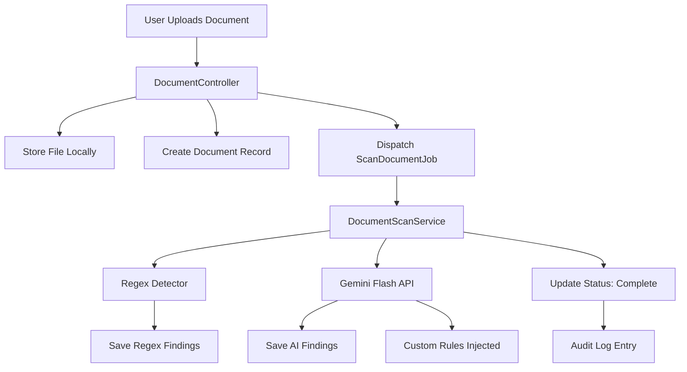

# 🛡️ Palimpsest — AI-Powered Document Security (DLP)

**Palimpsest** is an AI-powered Data Loss Prevention (DLP) tool built with Laravel. It catches sensitive information — credit cards, SSNs, API keys, confidential business data — before it leaks, using a two-pass detection pipeline: fast regex pattern matching followed by contextual AI analysis via Google's Gemini Flash.

> *"A palimpsest is a manuscript where the original text has been scraped away and written over — but traces of the original always remain. Your sensitive data works the same way."*

---

## ⚡ Features

### Built ✅

- **Two-Pass Detection Pipeline**
  - **Regex Pass**: Catches structured patterns (credit cards, SSNs, API keys, emails, phone numbers, passwords, private keys)
  - **AI Pass (Gemini Flash)**: Catches contextual/semantic sensitive data that regex can't (e.g., *"the merger price is $40/share"*, internal codenames)

- **Multimodal Scanning**: Upload text files, PDFs, and images — Gemini Flash analyzes them all using vision capabilities

- **Async Queue Processing**: Documents are scanned in the background via Laravel Queues. No blocking uploads.

- **Role-Based Access Control (RBAC)**:
  - **Admin/Compliance**: See raw (unredacted) findings with actual sensitive data
  - **Regular Users**: See redacted view with `[REDACTED: reason]` markers

- **Custom Detection Rules**: Admins can define domain-specific rules (e.g., *"Flag mentions of 'Project Phoenix'"*) that are injected into the AI prompt

- **Field-Level Encryption**: Sensitive finding snippets are encrypted at rest using Laravel's `encrypted` cast

- **Audit Logging**: Every upload, view, and scan is tracked with who/what/when


- **Dashboard**: Real-time stats — documents scanned, findings by severity, regex vs AI detection breakdown, recent activity feed

- **Comprehensive Test Suite**: Pest/PHPUnit tests covering upload flow, regex detector, RBAC, job dispatching, and access control

### Roadmap 🗺️

- [ ] **REST API**: `POST /api/scan` endpoint for external integrations
- [ ] **Real-Time Updates**: WebSocket broadcasting via Laravel Reverb
- [ ] **Multi-Tenancy**: Team-based workspaces with tenant isolation
- [ ] **Supabase Storage**: Migrate from local filesystem to Supabase Storage
- [ ] **Laravel Horizon**: Redis-backed queue monitoring dashboard
- [ ] **Bulk Upload**: Upload and scan multiple documents at once
- [ ] **Export Reports**: Download scan reports as PDF/CSV

---

## 🏗️ Architecture



---

## 🛠️ Tech Stack

| Layer | Technology |
|-------|-----------|
| **Framework** | Laravel 13 |
| **Frontend** | Blade + Tailwind CSS |
| **Auth** | Laravel Breeze |
| **Database** | PostgreSQL (Supabase) |
| **AI Engine** | Google Gemini Flash API |
| **Queue** | Laravel Database Queue Driver |
| **Encryption** | Laravel `encrypted` cast |
| **Testing** | Pest / PHPUnit |

---

## 🚀 Setup

### Prerequisites
- PHP 8.3+
- Composer
- Node.js 18+
- PostgreSQL database (we use Supabase)
- Google Gemini API key

### Installation

```bash
# Clone the repository
git clone https://github.com/rubayetkabirzisan/Palimpsest-Sentinel.git
cd Palimpsest-Sentinel

# Install dependencies
composer install
npm install

# Environment setup
cp .env.example .env
php artisan key:generate
```

### Configure `.env`

```env
# Database (Supabase PostgreSQL)
DB_CONNECTION=pgsql
DB_HOST=your-supabase-host.pooler.supabase.com
DB_PORT=6543
DB_DATABASE=postgres
DB_USERNAME=postgres.your-project-ref
DB_PASSWORD=your-password

# Gemini Flash API
GEMINI_API_KEY=your-gemini-api-key
```

### Run

```bash
# Run migrations and seed demo users
php artisan migrate
php artisan db:seed

# Build frontend assets
npm run build

# Start the application
php artisan serve

# In a separate terminal — start the queue worker
php artisan queue:work
```

### Demo Accounts

| Role | Email | Password |
|------|-------|----------|
| Admin | `admin@palimpsest.dev` | `password` |
| Compliance | `compliance@palimpsest.dev` | `password` |
| User | `user@palimpsest.dev` | `password` |

---

## 🧪 Running Tests

```bash
php artisan test
```

---

## 📁 Project Structure

```
app/
├── Http/Controllers/
│   ├── AuditLogController.php       # Audit log viewing
│   ├── CustomRuleController.php     # CRUD for detection rules
│   ├── DashboardController.php      # Stats and activity dashboard
│   └── DocumentController.php       # Upload, view, delete documents
├── Jobs/
│   └── ScanDocumentJob.php          # Queued background scanning
├── Models/
│   ├── AuditLog.php
│   ├── CustomRule.php
│   ├── Document.php
│   ├── Finding.php
│   └── User.php
├── Providers/
│   └── AppServiceProvider.php       # Gates for RBAC
└── Services/
    ├── DocumentScanService.php      # Orchestrates regex + AI pipeline
    ├── GeminiService.php            # Gemini Flash API integration
    └── RegexDetector.php            # Pattern-based detection engine
```